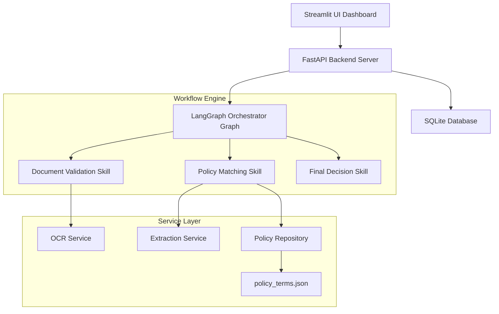

# Claims Agentic Health - Insurance Claims Engine

An agentic health insurance claims processing application powered by a modular orchestrating State Graph (**LangGraph**), **FastAPI**, **Streamlit**, and **SQLite** persistence. The workflow integrates rules-based verification pipelines matching corporate policy guidelines and patient claims history.

---

## 🌟 Key Architecture & Features



The system is split into two major layers:
1. **Application & Infrastructure Layer:** A responsive Streamlit dashboard interface communicates with a FastAPI server that acts as the entry point. The FastAPI backend queries/persists run and traces directly to a local SQLite database (`data/claims_runs.sqlite3`).
2. **Modular Decision Engine:** Built on a LangGraph state graph that invokes three separate, isolated Python skill modules sequentially:
   * **Stage 1 (Document Validation):** Analyzes OCR output metadata to verify document type completeness, readability, and patient consistency.
   * **Stage 2 (Policy Matching):** Executes policy rules matching diagnoses waiting periods, exclusions, limits, network hospitals discounts, and same-day frequency check thresholds.
   * **Stage 3 (Final Decision):** Generates consolidated outcomes and confidence ratings.

### 1. Stage-Based Modular Skills
The workflow logic is separated into independent processing modules under `src/claims_app/skills/` (and registered as agent custom skills in `.agents/skills/`):
- **Document Validation Skill:** Programmatically verifies the completeness and correct type of uploaded claims documentation (e.g. consultations require doctor prescription and hospital bills). Ensures files are legible and flags patient mismatches.
- **Policy Matching Skill:** Checks member eligibility against the **ICICI Lombard GHI Standard Plan** rules in `data/policy_terms.json`. Validates waiting periods, exclusions (full/partial), coverage limits, pre-authorization criteria, network discount eligibility, and same-day frequency checks.
- **Final Decision Skill:** Consolidates evaluations to output outcome classifications (`APPROVED`, `PARTIAL`, `REJECTED`, `MANUAL_REVIEW`, `DOCUMENT_ERROR`) alongside a confidence rating and details.

### 2. Robust Persistence & API Real-Time Lookup
- Live submissions write trace states directly into SQLite (`data/claims_runs.sqlite3`).
- API lookup endpoints `/claims/{claim_id}` and `/claims/{claim_id}/trace` are state-consistent, falling back to SQLite queries to survive server restarts.

---

## 🚀 How to Run the Project

### Prerequisites
Make sure `uv` is installed on your machine.

### 1. Install Dependencies
Run the sync command in the project directory:
```bash
uv sync --extra dev
```

### 2. Configure Environment Variables
Copy `.env.example` to `.env` and populate your API credentials:
```bash
cp .env.example .env
```

### 3. Launch Services
Start the claims processing API:
```bash
uv run claims-api
```
Start the Streamlit UI dashboard in another terminal:
```bash
uv run claims-ui
```

---

## 🧪 Testing & Validation

### Running Unit Tests
Validate workflow, repository, and graph parsing rules:
```bash
uv run pytest
```

### Batch Case Evaluation
Evaluate the 12 corporate standard test cases (patient directories, unreadable bills, waiting checks, network discounts) against the LangGraph workflow:
```bash
uv run claims-eval-cases data/assignment_test_cases.json
```
