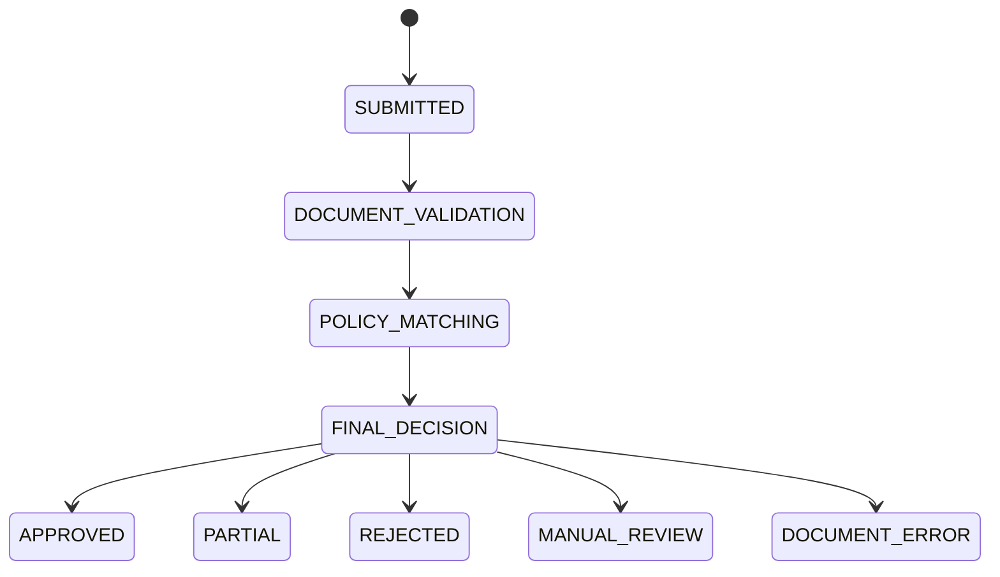
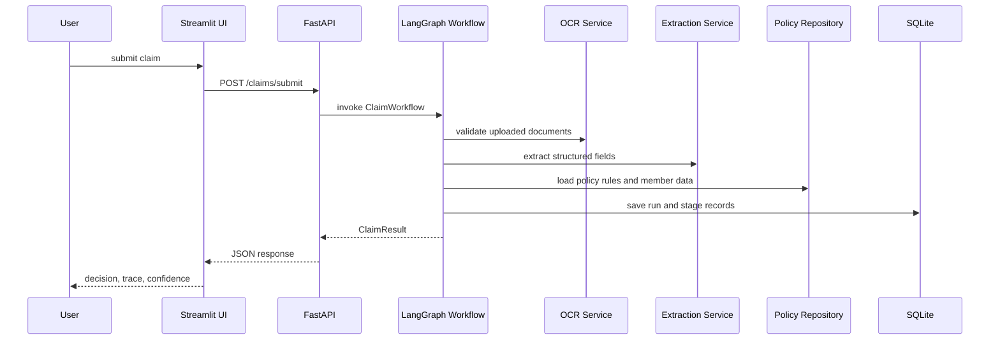

# Claims Processing Application Architecture

## 1. Overview

This system processes health insurance claims with one LangGraph-orchestrated workflow that always runs three explicit stages in order:

1. Document validation
2. Policy matching
3. Final decision

The application accepts claims, validates uploaded documents, compares them to policy terms, returns a transparent decision with confidence, and stores each run locally for review. The repo also includes a deterministic assignment runner for the 12 supplied test cases.

## 2. What the system is made of

### Frontend

The Streamlit app in [src/claims_app/ui.py](src/claims_app/ui.py) provides:

- a claim submission form
- document upload controls
- decision and confidence display
- stage trace cards
- a SQLite-backed run table
- the assignment test-case runner
- a LangSmith readiness banner

### Backend API

The FastAPI service in [src/claims_app/api.py](src/claims_app/api.py) exposes:

- live claim submission
- claim lookup by id
- trace lookup
- run history
- batch assignment execution
- a health endpoint that reports LangSmith readiness

### Workflow Engine

The core claim path is in [src/claims_app/workflow/engine.py](src/claims_app/workflow/engine.py). It builds a LangGraph state machine with three nodes:

- document_validation
- policy_matching
- final_decision

The graph returns a structured [ClaimResult](src/claims_app/models.py) containing validation output, extraction output, policy checks, stage records, confidence, and the final decision.

### Policy Repository

Policy rules live in [data/policy_terms.json](data/policy_terms.json) and are loaded by [src/claims_app/services/policy.py](src/claims_app/services/policy.py). That file is the source of truth for:

- claim types
- required documents
- coverage limits
- co-pay rates
- waiting periods
- exclusions
- member roster
- document keywords

### OCR and Extraction Services

The OCR adapter in [src/claims_app/services/ocr.py](src/claims_app/services/ocr.py) sends supported files to the NVIDIA OCR endpoint and falls back to local parsing when needed. The extraction service in [src/claims_app/services/extraction.py](src/claims_app/services/extraction.py) turns OCR text into structured claim facts using ChatNVIDIA when available, otherwise heuristic fallback logic.

### Persistence

Local persistence lives in [src/claims_app/db.py](src/claims_app/db.py). It stores each run and stage record in SQLite so the UI can show history and the evaluation report can inspect exact traces.

### Observability

LangSmith tracing is configured in [src/claims_app/observability.py](src/claims_app/observability.py). The app sets tracing environment variables when configured and uses tracing contexts around live claims and assignment execution.

### Assignment Runner

The deterministic evaluation path in [src/claims_app/case_runner.py](src/claims_app/case_runner.py) is separate from the live OCR/LLM claim path. It exists to replay the 12 assignment cases exactly and persist the results reproducibly.

## 3. Workflow Shape

The system is a single workflow orchestrator implemented as a LangGraph `StateGraph`.

The nodes are deterministic workflow steps, not independent AI agents.

### State Diagram



### Sequence Diagram



## 4. Explicit LangGraph State

The workflow passes a shared state object through the nodes. The implementation keeps the state small and traceable.

```python
class ClaimState(TypedDict, total=False):
    claim: ClaimInput
    claim_id: str
    ocr_documents: list[OCRDocument]
    validation: DocumentValidationResult
    extraction: ExtractionResult
    policy_checks: list[PolicyCheck]
    policy_resolution: dict[str, Any]
    decision: ClaimResult
    confidence: float
    stage_records: list[StageRecord]
    degraded: bool
```

### Why these fields exist

- `claim` carries the user submission.
- `ocr_documents` carries the OCR output for downstream stages.
- `validation` stores the document-stage outcome.
- `extraction` stores structured facts from OCR text.
- `policy_checks` records each policy rule that was tested.
- `policy_resolution` stores the computed decision before final packaging.
- `decision` stores the final response returned to the user.
- `confidence` captures how much the system trusts the result.
- `stage_records` keeps the visible audit trail.
- `degraded` marks that the workflow continued with reduced quality.

## 5. How the components interact

### Live claim flow

1. The user submits a claim in the UI or API.
2. The API/UI builds a `ClaimInput`.
3. The workflow validates uploaded documents.
4. If validation fails, the workflow stops and returns `DOCUMENT_ERROR` with a clear user-facing message.
5. If validation passes, the workflow extracts structured evidence from OCR text.
6. The policy layer checks the claim against policy rules.
7. The final decision stage converts the policy outcome into `APPROVED`, `PARTIAL`, `REJECTED`, or `MANUAL_REVIEW`.
8. The result is stored in SQLite and rendered in the UI.

### Assignment-case flow

1. The user uploads the assignment JSON or posts it to the batch endpoint.
2. The assignment runner evaluates each case deterministically.
3. Each case produces a trace reference, stage records, decision, message, and confidence.
4. The run is persisted in SQLite.
5. The UI shows the latest results and the database-backed run list.

## 6. Why this design was chosen

### One orchestrator, three explicit stages

A single orchestrator keeps behavior easy to trace and reason about. The stage boundaries are explicit so document problems stop early, policy problems remain explainable, and the final decision stays deterministic.

### Separate live and assignment paths

The live workflow is OCR/LLM-assisted and suitable for real claims. The assignment runner is deterministic so the 12 evaluation cases can be replayed exactly and compared reliably against expected output.

### SQLite for local persistence

SQLite is enough for the current load, keeps the system portable, and avoids operational overhead while still allowing the UI to present run history and stage traces.

### Streamlit for the UI

Streamlit keeps the review interface simple to run locally, which matters for an assignment workflow where visibility and iteration speed are more important than a heavily customized frontend framework.

### FastAPI for the service boundary

FastAPI gives a clean API surface for live submission, trace lookup, and batch evaluation without coupling the UI to the workflow internals.

## 7. What we considered and rejected

### Multi-agent routing

Rejected because the claims flow is easier to explain and debug as a single stage-based orchestrator. Multiple agents would add handoff complexity without improving the assignment goals.

### A database-first enterprise stack

Rejected for the current scope because the system does not need distributed persistence, queues, or background workers to satisfy the assignment and local test cases.

### UI-only implementation

Rejected because the user explicitly needed backend + frontend separation, local storage, and observable processing behavior.

### Pure heuristic processing for everything

Rejected because live claims need OCR and structured extraction, but assignment cases also need reproducibility. The design uses OCR/LLM where appropriate and a deterministic evaluator where exact replay matters.

## 8. Retry Policy and Confidence

### Retry Policy

```text
OCR Service
- Retry: 2 times
- Timeout: 10 seconds
- Fallback: return an OCR document with an error field

LLM Extraction
- Retry: 1 time
- Timeout: bounded by the model client
- Fallback: heuristic extraction
```

### Confidence Formula

The workflow confidence is reduced when evidence quality drops or a stage degrades.

```text
confidence = 1.0
  - 0.2 if OCR quality is poor
  - 0.3 if extraction is degraded
  - 0.2 if policy evidence is incomplete
  - 0.4 if a component failure occurred
```

The final value is clamped between 0.1 and 0.99.

## 9. Limitations of the current design

### Limited concurrency

SQLite and a single-process local app are fine for a small assignment workload, but they are not ideal for many simultaneous claims.

### Local-only persistence

The current database is local, so it is not suited for multi-user production deployment or cross-device access.

### Deterministic assignment runner is separate from live claims

This is intentional, but it means the assignment path is not a production claims engine. It is a reproducible evaluator for the test cases.

### OCR and extraction quality depend on input quality

Unreadable files still need manual correction. The system handles that safely, but it cannot recover data that is not present or legible.

### LangSmith visibility depends on environment configuration

Tracing only appears when the LangSmith API key and tracing flags are correctly set in the runtime environment.

## 10. How to scale this 10x

At roughly 10x the current load, the design should evolve in these ways:

- Move SQLite to Postgres for concurrency, durability, and queryability.
- Split workflow execution from the API into a background worker service.
- Cache policy terms and reference data in memory or Redis.
- Store uploads in object storage instead of in-process memory.
- Add idempotency keys for claim submissions and batch runs.
- Emit structured telemetry to a centralized observability pipeline.
- Keep LangSmith for trace inspection, but complement it with service metrics and logs.
- Add horizontal scaling for the API and UI behind a load balancer.

## 11. Architectural invariants

- Document validation always runs before policy matching.
- Policy matching never runs when the uploaded documents are clearly wrong or unreadable.
- Every final decision includes an explanation, a confidence score, and stage records.
- Any stage failure must remain visible to the user.
- The assignment runner must stay deterministic so the 12 cases remain reproducible.

## 12. Data Model

### Claim Submission
- member id or member name
- treatment type
- claimed amount
- documents
- claim date
- optional notes

### Document Metadata
- filename
- file type
- document category
- upload status
- quality score
- OCR or parse status

### Policy Check Result
- rule name
- status
- reason
- evidence reference
- confidence impact

### Final Decision
- decision type
- approved amount
- reason
- confidence score
- stage trace
- error state if present

## 13. UI Architecture

### Screens
- Claim submission screen
- Validation status screen
- Policy check screen
- Final decision screen
- Error and trace screen

### UI Requirements
- Clear labels
- Plain-language errors
- Stage progress indicator
- Decision summary
- Confidence display
- Trace details for operations users

### UX Principle
The user should always know:
- what was checked
- what passed
- what failed
- what to do next

## 14. Observability

Use LangSmith to trace:
- request input
- document validation output
- policy matching output
- final decision output
- stage errors
- fallback behavior
- confidence calculation

Every trace should include:
- stage name
- timestamps
- rule identifiers
- error details
- degraded-state markers

## 15. Technology Stack

- Python
- uv
- FastAPI
- Streamlit
- LangGraph or LangChain
- LangSmith
- PDF/image parsing and OCR libraries
- JSON policy storage

## 16. Key Non-Functional Requirements

- No crashes on bad input
- Clear user-facing errors
- Explainable decisions
- Policy logic must come from `policy_terms.json`
- Traces must show stage-level behavior
- Confidence must reflect missing or unreadable evidence

## 17. Scope Boundaries

### In Scope
- claim submission
- document validation
- policy matching
- final decisioning
- UI display
- tracing and observability

### Out of Scope
- payment settlement
- fraud investigation
- insurer ERP integration
- external member portal authentication unless required later
- human override workflows beyond manual review state
